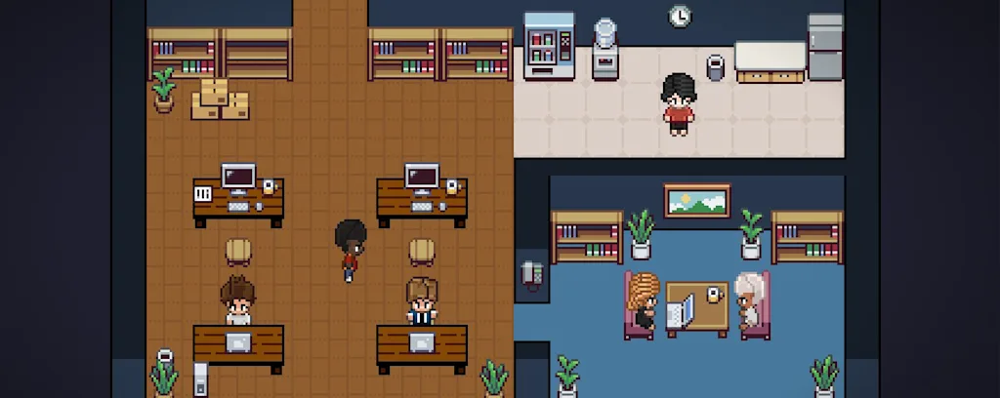

# Agent Office

Interface web para interagir com agentes Claude especializados através de um escritório virtual em pixel art. Cada personagem no canvas representa um agente — o coordinator orquestra o fluxo e delega para os especialistas conforme necessário.



## O que faz

- Chat em tempo real com agentes Claude via WebSocket
- Coordinator central que delega para agentes especializados (architect, backend_dev, frontend_dev, qa, etc.)
- Canvas pixel art que ilumina o agente que está a trabalhar em cada momento
- Sessões persistidas em SQLite para retomar conversas anteriores
- Agente totalmente autónomo — executa comandos, instala dependências e cria projetos sem pedir aprovação

## Agentes disponíveis

| Agente | Função |
|---|---|
| `coordinator` | Orquestrador principal — ponto de entrada, decide quem age |
| `discovery` | Explora ideias, define problema e requisitos |
| `architect` | Propõe stack e arquitectura com trade-offs |
| `challenger` | Questiona e debate a arquitectura proposta |
| `synthesizer` | Consolida o debate numa decisão final |
| `dba` | Design e alterações de base de dados |
| `devops` | Ambiente, dependências, configuração de sistema |
| `backend_dev` | Implementação de API, models e lógica |
| `frontend_dev` | Implementação de UI, CSS e componentes |
| `qa` | Validação e testes antes de entregar |

## Requisitos

- Python 3.11+
- [Claude Code CLI](https://claude.ai/code) instalado e autenticado (`claude` no PATH)
- Node.js / npm (para projetos que o agente venha a criar)

## Instalação e arranque

```powershell
git clone https://github.com/EnzoMDias/business-agents -b agents-office-work
cd business-agents
powershell -ExecutionPolicy Bypass -File .\start.ps1
```

O `start.ps1` trata de tudo automaticamente:
1. Verifica Python 3.11+
2. Cria o `.env` com o caminho correto para esta máquina
3. Cria o `venv` e instala as dependências
4. Abre o browser em `http://localhost:8000`

Não é necessária nenhuma configuração manual.

## Estrutura do projeto

```
business-agents/           ← pasta criada pelo git clone
├── .claude/
│   └── agents/            # Definições dos agentes (.md)
├── backend/
│   ├── __init__.py
│   ├── main.py            # FastAPI app, rotas e WebSocket
│   ├── runner.py          # Invoca o Claude CLI via subprocess
│   ├── ws.py              # Handler WebSocket, streaming e sessões
│   ├── session_manager.py
│   ├── database.py
│   ├── models.py
│   └── db/
│       └── schema.sql     # Schema SQLite
├── frontend/
│   ├── index.html
│   ├── css/
│   └── js/
│       ├── app.js         # Entry point
│       ├── ws.js          # Cliente WebSocket
│       ├── chat.js        # Renderização do chat
│       ├── office.js      # Canvas do escritório
│       ├── scene.js       # Cena pixel art
│       └── sprites.js     # Sprites dos agentes
├── .env.example
├── requirements.txt
└── start.ps1
```

## Configuração

O ficheiro `.env` é gerado automaticamente pelo `start.ps1`. As variáveis disponíveis são:

| Variável | Descrição | Padrão |
|---|---|---|
| `PORT` | Porto do servidor | `8000` |
| `CLAUDE_WORK_DIR` | Directório de trabalho do agente | Auto-detectado |

## Protocolo WebSocket

**Envio (cliente → servidor):**
```json
{ "type": "message", "content": "texto", "agent": "coordinator", "session_id": null }
```

**Recepção (servidor → cliente):**
```json
{ "type": "session_id", "session_id": "uuid" }
{ "type": "chunk", "content": "texto parcial", "agent": "coordinator" }
{ "type": "active_agent", "agent": "backend_dev" }
{ "type": "done" }
{ "type": "error", "error": "mensagem" }
{ "type": "session_expired", "agent": "coordinator" }
```

## Tecnologias

**Backend:** Python, FastAPI, uvicorn, aiosqlite, WebSockets  
**Frontend:** HTML/CSS/JS vanilla, Canvas API  
**IA:** Claude Code CLI com `--dangerously-skip-permissions` (modo autónomo, sem prompts de autorização)
